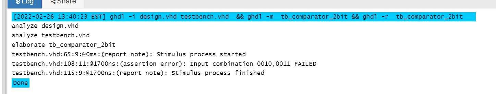

# Lab 2: Benjamin Nimmerrichter

Preparation:
 | **Dec. equivalent** | **B[1:0]** | **A[1:0]** | **B is greater than A** | **B equals A** | **B is less than A** |
   | :-: | :-: | :-: | :-: | :-: | :-: |
   |  0 | 0 0 | 0 0 | 0 | 1 | 0 |
   |  1 | 0 0 | 0 1 | 0 | 0 | 1 |
   |  2 | 0 0 | 1 0 | 0 | 0 | 1 |
   |  3 | 0 0 | 1 1 | 0 | 0 | 1 |
   |  4 | 0 1 | 0 0 | 1 | 0 | 0 |
   |  5 | 0 1 | 0 1 | 0 | 1 | 0 |
   |  6 | 0 1 | 1 0 | 0 | 0 | 1 |
   |  7 | 0 1 | 1 1 | 0 | 0 | 1 |
   |  8 | 1 0 | 0 0 | 1 | 0 | 0 |
   |  9 | 1 0 | 0 1 | 1 | 0 | 0 |
   | 10 | 1 0 | 1 0 | 0 | 1 | 0 |
   | 11 | 1 0 | 1 1 | 0 | 0 | 1 |
   | 12 | 1 1 | 0 0 | 1 | 0 | 0 |
   | 13 | 1 1 | 0 1 | 1 | 0 | 0 |
   | 14 | 1 1 | 1 0 | 1 | 0 | 0 |
   | 15 | 1 1 | 1 1 | 0 | 1 | 0 |

### 2-bit comparator

1. Karnaugh maps for other two functions:

   **Greater than:**

   | **B v ,A >** | **00** | **01** | **11** | **10** |
   | :-: | :-: | :-: | :-: | :-: |
   | **00** | 0 | 0 | 0 | 0 |
   | **01** | 1 | 0 | 0 | 0 |
   | **11** | 1 | 1 | 0 | 1 |
   | **10** | 1 | 1 | 0 | 0 |

   **Less than:**

   | **B v ,A >** | **00** | **01** | **11** | **10** |
   | :-: | :-: | :-: | :-: | :-: |
   | **00** | 0 | 1 | 1 | 1 | 
   | **01** | 0 | 0 | 1 | 1 | 
   | **11** | 0 | 0 | 0 | 0 |
   | **10** | 0 | 0 | 1 | 0 |
   
   *equals:*
   | **B v ,A >** | **00** | **01** | **11** | **10** |
   | :-: | :-: | :-: | :-: | :-: |
   | **00** | 1 | 0 | 0 | 0 | 
   | **01** | 0 | 1 | 0 | 0 | 
   | **11** | 0 | 0 | 1 | 0 |
   | **10** | 0 | 0 | 0 | 1 |

2. Equations of simplified SoP (Sum of the Products) form of the "greater than" function and simplified PoS (Product of the Sums) form of the "less than" function.

   

### 4-bit comparator

1. Listing of VHDL stimulus process from testbench file (`testbench.vhd`) with at least one assert (use BCD codes of your student ID digits as input combinations). Always use syntax highlighting, meaningful comments, and follow VHDL guidelines:

   Last two digits of my student ID: **xxxx??**

```vhdl
      p_stimulus : process
    begin
    --4-BIT----xxxx23
        -- Report a note at the beginning of stimulus process
        report "Stimulus process started" severity note;
        s_d <= "0000"; s_c <= "0000"; wait for 100 ns;
 		s_d <= "0010"; s_c <= "0011"; wait for 100 ns;
        
        assert ((s_D_greater_C = '0') and
               (s_D_equals_C  = '0') and
                (s_D_less_C    = '1'))
        -- If false, then report an error
        report "Input combination 0010,0011 FAILED" severity error;
 		s_d <= "0011"; s_c <= "0010"; wait for 100 ns;

        -- Report a note at the end of stimulus process
        report "Stimulus process finished" severity note;
        wait;
    end process p_stimulus;
end architecture testbench;
    end process p_stimulus;
```

2. Text console screenshot during your simulation, including reports.

   

3. Link to your public EDA Playground example:

   [2bit comparator](https://www.edaplayground.com/x/vkGR)
   [4bit comparator](https://www.edaplayground.com/x/DCqz)
